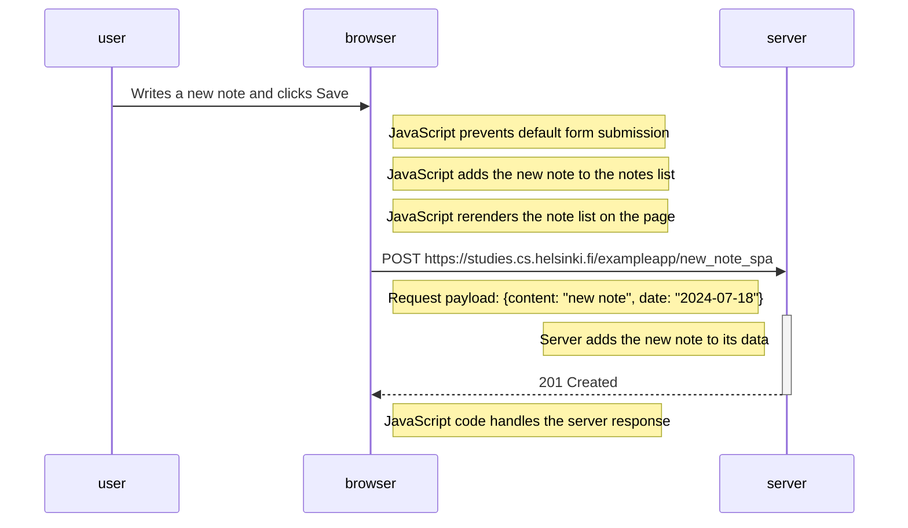

```mermaid
sequenceDiagram
    participant user
    participant browser
    participant server

    user->>browser: Writes a new note and clicks Save
    Note right of browser: JavaScript prevents default form submission
    Note right of browser: JavaScript adds the new note to the notes list
    Note right of browser: JavaScript rerenders the note list on the page
    browser->>server: POST https://studies.cs.helsinki.fi/exampleapp/new_note_spa
    Note right of browser: Request payload: {content: "new note", date: "2024-07-18"}
    activate server
    Note left of server: Server adds the new note to its data
    server-->>browser: 201 Created
    deactivate server
    Note right of browser: JavaScript code handles the server response
```
